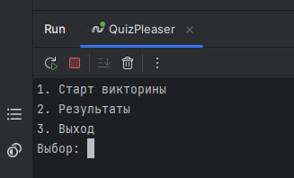
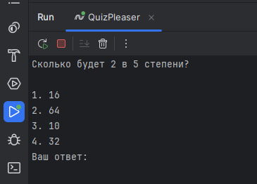
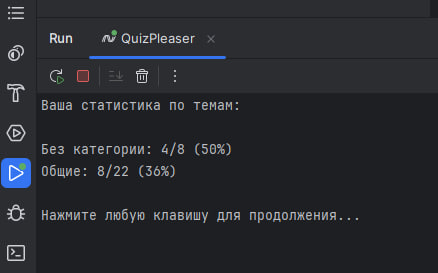
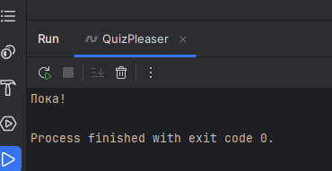

# quiz-pleaser

QuizPleaser is a CLI quiz app with localization, typed text effect, YAML-based questions, and persistent result tracking.

This started as a simple exam project but turned into a mini-framework for terminal-based quizzes with themes, stats, and config handling.

---

## clowning

```bash
git clone https://github.com/yourname/QuizPleaser.git
cd QuizPleaser
dotnet run
```

.NET 8 SDK is required.

## build

```bash
dotnet publish -c Release -r win-x64 --self-contained true -p:PublishSingleFile=true
```

.exe file in:
```bash
bin/Release/net8.0/win-x64/publish/
```

## what project does

When you launch the app:

1. You choose a language (saved to `config.json`)
2. You're shown a menu:
    - Start quiz
    - View results
    - Exit
3. You can play a randomized quiz based on loaded questions
4. All your answers are stored with result tracking (by theme, correctness, timestamp)

---

## 🤓 a bit about the architecture

- Uses **Dependency Injection** (`Microsoft.Extensions.DependencyInjection`)
- Menu logic is abstracted through a shared interface: `IMenuAction`
- Each action (start quiz, view results, exit) is its own class
- All logic is separated into services like:
    - `YamlLoader` — reads YAML questions/themes
    - `ResultService` — saves and loads quiz results
    - `QuizService` — quiz logic: filtering, randomizing, hashing
    - `JsonLocalizer` — loads strings from `.json` files per selected language

Everything is injectable and extendable. You can plug in new logic without touching existing actions.

---

## custom content

You can freely edit the question pool and themes. Just go into the `Data/` folder:

### `questions.yaml`

```yaml
questions:
  - text: Who developed the theory of relativity?
    theme: science
    answers:
      - Newton
      - Einstein
      - Galileo
      - Hawking
    correct_answer_index: 1
```

```yaml
themes:
  - id: science
    title: Science
    description: Physics, chemistry, biology
```

## localization
- App asks for your preferred language on first launch
- Choice is saved to config.json
- Language files live in Localization/ folder
- Add new ones by creating xx.json (e.g. fr.json)

## results

In the menu, there's a "Results" option that shows how well you did by theme.
Stats are based on all your previous answers.

Each saved answer contains:

- Hash of the question
- Theme ID
- Was the answer correct
- Timestamp

## screenshots (with ru localization)

### first look



---

### start quiz in action



---

### results in action



---

### exit in action



